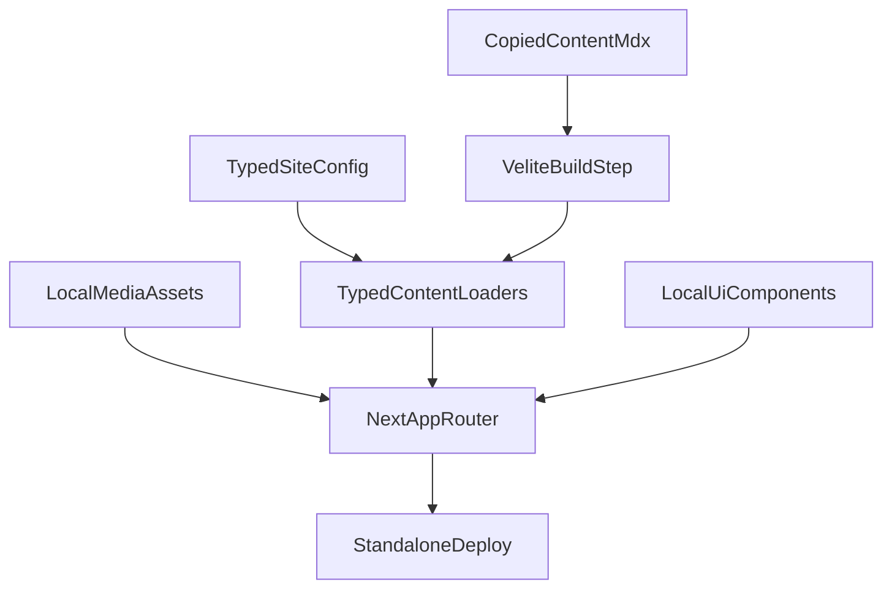

# Standalone Portfolio Extraction Roadmap

## Executive Summary

The current `apps/portfolio-site` app is not a clean candidate for a straight copy-paste extraction. It mixes three concerns:

1. Monorepo-only shared packages (`@turbodima/ui`, `@turbodima/core`, `@turbodima/configs`)
2. Optional WordPress/CMS integration
3. Local content spread across MDX and TypeScript data

Plain English version:
The old site is not just "a portfolio app with content." It is a portfolio app, a CMS adapter, and a shared design-system consumer all at once. If we copy it as-is, we will inherit old complexity instead of getting a clean standalone portfolio.

The standalone site should be treated as a rebuild with selective reuse, not as a literal extraction.

## What We Know Right Now

### Old App Facts

- `apps/portfolio-site/package.json` depends on `@turbodima/ui`, `@turbodima/core`, and `@turbodima/configs`
- `apps/portfolio-site/app/layout.tsx` imports `@turbodima/ui/styles/index.css`
- `apps/portfolio-site/lib/actions/portfolio-actions.ts` switches between WordPress and local fallback data
- `apps/portfolio-site/lib/utils/hybrid-content.ts` merges MDX and WordPress content
- `apps/portfolio-site/contentlayer.config.ts` defines `blog`, `project`, `case-study`, `dj-set`, and `company` document types
- `apps/portfolio-site/app/work/[slug]/page.tsx` does **not** use the copied MDX work content directly; it reads `lib/data/portfolio-data.ts` when WordPress is off
- `apps/portfolio-site/content/projects/portfolio-site.mdx` still explicitly describes the old hybrid WordPress + MDX model

### New Standalone Repo Facts

- `dima-portfolio` currently contains:
  - `README.MD` (empty)
  - `content/blog/*`
  - `content/case-studies/*`
  - `content/dj-sets/*`
  - `content/projects/*`
- The copied MDX content still contains stale references to `ContentLayer`, WordPress, and the old architecture
- There is no standalone app shell yet, only copied content

## Recommended Direction

### Core Recommendation

Build `dima-portfolio` as a new standalone Next.js App Router app, then migrate only the content and the small amount of UI/patterns worth reusing.

### Stack Recommendation

- Framework: Next.js App Router
- Runtime: React 19
- Styling: Tailwind CSS 4
- Language: TypeScript
- Content: MDX for long-form content, plus a small typed config layer for singleton site data
- MDX pipeline: **Velite**, not Contentlayer
- Forms: server actions
- Images: local `public/` assets wherever possible

Plain English version:
MDX is still a good choice here, but `Contentlayer` is not the best bet for a new build anymore. The safer modern version of your idea is "MDX, but with a newer typed content pipeline and a much simpler architecture."

### Why Not Just Keep Contentlayer?

- It was already adding complexity in the monorepo
- The copied content still reflects the old hybrid setup
- The project is not the best choice for a fresh 2026 standalone portfolio
- The current app already demonstrates the danger of having too many overlapping content paths

### Why Not Use Pure MDX For Everything?

Because some content is better represented as structured data than as documents.

Use MDX for:

- blog posts
- case studies
- personal projects
- optional DJ set writeups / notes

Use typed config/data for:

- profile name, title, summary, contact links
- navigation
- social links
- site metadata
- optional testimonials if you keep them

Plain English version:
Long pages should live in MDX. Small structured site settings should live in a typed file, not in fake MDX documents.

## Target Architecture



## Proposed File / Folder Shape

This keeps the app simple and avoids recreating monorepo complexity.

```text
dima-portfolio/
  app/
    (marketing)/
      page.tsx
      about/page.tsx
      work/page.tsx
      work/[slug]/page.tsx
      blog/page.tsx
      blog/[slug]/page.tsx
      playground/page.tsx
      contact/page.tsx
    api/...
    layout.tsx
    sitemap.ts
    robots.ts
  components/
    site/
    ui/
    mdx/
  content/
    blog/
    work/
    playground/
    site/
  lib/
    content/
    seo/
    utils/
    validations/
  public/
    images/
    resume/
  docs/
```

## Content Model Recommendation

### Biggest Content Cleanup

The current content model is inconsistent:

- blog is MDX-driven
- work is mostly TypeScript-data-driven when WordPress is off
- DJ sets have content files but no real route integration

That should be collapsed into one content model.

### Recommended New Model

#### `content/work/*.mdx`

Unify `projects` and `case-studies` into a single work collection.

Suggested frontmatter:

- `title`
- `slug`
- `summary`
- `date`
- `kind` (`project` or `case-study`)
- `featured`
- `tags`
- `technologies`
- `role`
- `client`
- `year`
- `website`
- `github`
- `coverImage`
- `seoTitle`
- `seoDescription`

Body content should contain the long-form narrative.

#### `content/blog/*.mdx`

Keep blog as MDX.

#### `content/playground/*.mdx`

Move DJ/music/home-lab style content under a single playground collection unless you explicitly want a first-class `/music` section.

Default recommendation:

- keep `/playground`
- optionally add subsections inside it
- do **not** keep orphaned DJ-set content with no route

#### `content/site/profile.ts`

Use a typed config file for:

- name
- title
- short bio
- email
- social links
- location
- resume path
- home hero copy

## Migration Mapping

| Old source | New destination | Notes |
| --- | --- | --- |
| `apps/portfolio-site/content/blog/*` | `dima-portfolio/content/blog/*` | Clean stale frontmatter and architecture references |
| `apps/portfolio-site/content/projects/*` + `content/case-studies/*` | `dima-portfolio/content/work/*` | Merge into one collection |
| `apps/portfolio-site/content/dj-sets/*` | `dima-portfolio/content/playground/*` or `content/dj-sets/*` | Only keep if routes are implemented |
| `apps/portfolio-site/lib/data/portfolio-data.ts` | `dima-portfolio/content/work/*` + `content/site/profile.ts` | Break static TS data into real content |
| `apps/portfolio-site/lib/actions/portfolio-actions.ts` | `dima-portfolio/lib/content/*` and `app/actions/*` | Replace CMS fetch layer with local loaders and server actions |
| `apps/portfolio-site/lib/utils/hybrid-content.ts` | delete | No hybrid source in standalone repo |
| `apps/portfolio-site/lib/adapters/*` | delete | Remove WordPress completely |
| `apps/portfolio-site/docs/CMS_INTEGRATION.md` and WP docs | replace with local-content docs | No CMS docs should survive |

## Phased Implementation Plan

## Phase 1: Create The Standalone App Skeleton

### Goal

Create a clean Next.js standalone app inside `dima-portfolio` and stop depending on the monorepo packages.

### Plain English

Before migrating content, we need a real app to migrate into. This phase creates the empty house before moving furniture in.

### Technical Breakdown

- initialize standalone `package.json`
- add Next.js App Router + React + TypeScript + Tailwind 4
- add ESLint and formatting setup locally
- create `app`, `components`, `lib`, `public`, and `docs`
- do **not** copy the old workspace package wiring
- do **not** bring over `@turbodima/core` or `@turbodima/configs`
- only copy specific UI patterns if they save time

### Checkpoint Commit

`chore: scaffold standalone portfolio app`

### Checklist

- [x] Initialize `dima-portfolio` as its own pnpm project
- [x] Add latest stable Next.js / React / TypeScript / Tailwind stack at implementation time
- [x] Add `app/layout.tsx`, `app/page.tsx`, and base global styles
- [x] Add path aliases for local imports only
- [x] Remove any monorepo-specific dependency assumptions
- [x] Add a real `README.md` for the standalone repo

## Phase 2: Define The New Content System

### Goal

Replace the old hybrid WordPress + MDX + TS-data model with one simple, local-first content system.

### Plain English

This is the most important architecture step. If we do not fix content first, the new repo will inherit the old confusion.

### Technical Breakdown

- add Velite with typed schemas
- create collections for `work`, `blog`, and `playground`
- create typed singleton config for profile and site settings
- define required frontmatter so missing data fails loudly
- remove all contentloader and WordPress assumptions

### Checkpoint Commit

`feat: add typed local content system`

### Checklist

- [x] Install and configure Velite
- [x] Define schemas for `work`, `blog`, `playground`, and singleton site config
- [x] Add typed content query helpers in `lib/content`
- [x] Decide final slug strategy before importing all content
- [x] Remove all hybrid-content logic from the new codebase
- [x] Document the content-writing workflow in `docs/`

## Phase 3: Normalize And Migrate Existing Content

### Goal

Move the copied content into the new content model and clean outdated references.

### Plain English

The copied MDX is a starting point, not production-ready content. It still talks about the old site and old tooling.

### Technical Breakdown

- merge `projects` and `case-studies` into `work`
- review every copied MDX file for stale mentions of:
  - WordPress
  - Contentlayer
  - placeholder URLs
  - fake company/client names
  - fake profile details
- convert `lib/data/portfolio-data.ts` into real content files or typed site config
- decide whether DJ content stays or gets folded into `playground`

### Checkpoint Commit

`refactor: migrate portfolio content into unified collections`

### Checklist

- [x] Create `content/work/`
- [x] Move and rename project/case-study files into the new work collection
- [ ] Port any missing detail from `lib/data/portfolio-data.ts`
- [x] Clean stale wording in copied MDX files
- [x] Replace fake demo URLs and names
- [x] Remove content that has no intended route
- [ ] Add local image references where possible

## Phase 4: Build The Local Design System And Site Shell

### Goal

Replace the `@turbodima/ui` dependency with a local, intentionally small UI layer.

### Plain English

The old site leans heavily on a shared package. For the standalone repo, that package is baggage unless we truly need all of it.

### Technical Breakdown

- rebuild only the components the standalone site actually needs
- start with layout primitives and page-level blocks
- prefer composition over giant "block" abstractions
- keep the component surface area small
- avoid copying the entire shared UI package

Suggested local components:

- `components/site/header.tsx`
- `components/site/footer.tsx`
- `components/site/hero.tsx`
- `components/site/work-card.tsx`
- `components/site/prose.tsx`
- `components/ui/button.tsx`
- `components/ui/tag.tsx`

### Checkpoint Commit

`feat: add local site shell and ui primitives`

### Checklist

- [x] Rebuild header and footer locally
- [x] Rebuild basic button, card, tag, and section primitives
- [x] Rebuild MDX rendering components locally
- [x] Replace old shared-block mindset with smaller local components
- [x] Keep styles and naming specific to this site

## Phase 5: Rebuild Routes On Top Of The New Data Model

### Goal

Implement the actual standalone pages using the local content system and local UI.

### Plain English

This is where the new site becomes real. The content model and local components come together into pages.

### Technical Breakdown

- home page reads featured work + profile config
- work listing reads the unified `work` collection
- work detail pages render MDX body content
- blog pages read blog collection
- about page reads typed profile config plus optional experience/skills content
- playground reads playground collection
- contact page uses server action and real destination

### Checkpoint Commit

`feat: rebuild portfolio routes on standalone architecture`

### Checklist

- [x] Build `/`
- [x] Build `/work`
- [x] Build `/work/[slug]`
- [x] Build `/blog`
- [x] Build `/blog/[slug]`
- [x] Build `/about`
- [x] Build `/playground`
- [x] Build `/contact`
- [ ] Add `not-found`, `sitemap`, metadata, and OG assets

## Phase 6: Remove WordPress Completely

### Goal

Ensure there are zero surviving WordPress assumptions in the new repo.

### Plain English

This is the cleanup phase that prevents "ghost CMS architecture" from lingering in a repo that no longer uses a CMS.

### Technical Breakdown

- remove WordPress env vars
- remove adapter layer concepts
- remove CMS wording from docs and content
- remove hybrid content utilities
- remove remote image rules tied to old media servers

### Checkpoint Commit

`refactor: remove wordpress and cms coupling`

### Checklist

- [ ] Remove every WordPress-related env var
- [ ] Remove every CMS adapter and config concept
- [ ] Remove docs that describe WordPress setup
- [ ] Remove stale content references to hybrid CMS architecture
- [ ] Replace old WP media URLs with local assets or approved domains

## Phase 7: Quality Pass, SEO, And Production Readiness

### Goal

Turn the rebuilt site into a polished, deployable portfolio.

### Plain English

This phase is about making sure the new site is not just working, but clean, coherent, and launch-ready.

### Technical Breakdown

- validate schemas against all content
- tighten metadata and structured data
- optimize images and page weight
- review typography and spacing
- test routes and content edge cases
- verify the contact flow

### Checkpoint Commit

`fix: harden standalone portfolio for launch`

### Checklist

- [ ] Validate all content against schemas
- [ ] Run lint, typecheck, and production build
- [ ] Review Lighthouse and Core Web Vitals
- [ ] Confirm social cards and metadata
- [ ] Check responsive layout across breakpoints
- [ ] Check all internal links
- [ ] Verify contact form behavior
- [ ] Review accessibility basics

## Phase 8: Launch And Decommission The Old App

### Goal

Move traffic and future development to the standalone repo cleanly.

### Plain English

After the new site is stable, stop treating the monorepo app as the active version.

### Technical Breakdown

- deploy the standalone site
- point the domain to the new repo
- archive or mark the monorepo app as deprecated
- preserve useful docs but stop updating the old portfolio app

### Checkpoint Commit

`chore: finalize standalone portfolio migration`

### Checklist

- [ ] Deploy the standalone site
- [ ] Verify production env vars
- [ ] Point domain / preview URLs correctly
- [ ] Mark old monorepo portfolio app as deprecated
- [ ] Remove ambiguity about which repo is the source of truth

## Suggested PR / Work Chunk Boundaries

If this work is pushed later, these are the cleanest review slices:

1. App scaffold and baseline tooling
2. New content system and schemas
3. Content migration and cleanup
4. Local UI and shell
5. Route rebuild
6. WordPress removal and production hardening

## Risks To Watch Closely

### Risk 1: Recreating The Old Architecture

If we copy too much from `apps/portfolio-site`, we will keep the same problems with different file paths.

### Risk 2: Content Migration Gaps

The copied MDX alone is not enough to preserve current `/work` behavior because important content still lives in `lib/data/portfolio-data.ts`.

### Risk 3: Placeholder Content Shipping To Production

The current app contains obvious placeholder names, summaries, testimonials, and image URLs. Those need a deliberate cleanup pass.

### Risk 4: Orphan Content Types

DJ sets exist as content but not as a real first-class routed feature in the current app. Decide whether they matter before rebuilding them.

## Default Decisions Unless We Explicitly Change Course

- Keep Next.js App Router
- Use MDX for long-form content
- Use Velite instead of Contentlayer
- Use local UI components instead of importing the entire old shared package
- Use one unified `work` collection
- Remove WordPress entirely
- Keep `/playground`, and fold music/DJ content into it unless a dedicated section becomes clearly valuable

## First Implementation Slice I Would Start With

If work begins immediately, the best order is:

1. scaffold the standalone app
2. define the new content schemas
3. convert `portfolio-data.ts` and copied MDX into one unified `work` model
4. rebuild the local header, footer, and work pages

Plain English version:
The fastest good path is "new shell, new content system, then migrate content, then rebuild pages." Not "copy old app first and clean it later."

